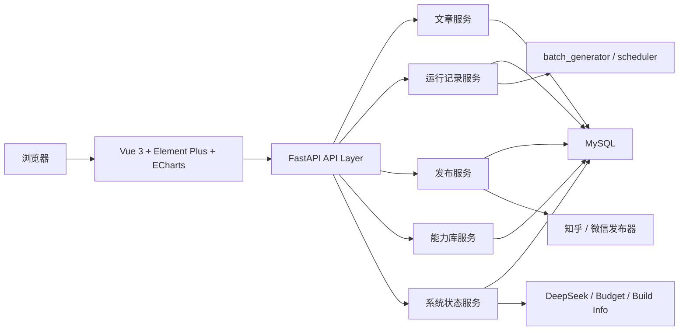
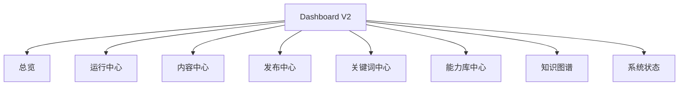

# Dashboard V2 技术方案图

## 目标

Dashboard V2 的目标不是单纯换一个更潮的前端，而是把当前 Dashboard 从演示型控制台升级为工程化中控台：

- 更稳定：页面刷新不影响写操作，长连接和缓存策略可控
- 更美观：统一设计语言，图表和表格表达更专业
- 更易维护：前后端职责分离，业务逻辑不再揉在 UI 文件里
- 更易扩展：后续接运行记录、发布审计、能力库、告警都不需要重写

## 当前问题

当前 Dashboard 基于 Streamlit，适合快速搭建，但已经到工程边界：

- UI、数据库访问、写操作、模型调用都在同一个页面文件
- 页面刷新会触发整页重跑，不适合长时间挂着当生产中控台
- 内容管理、发布、返修等高风险操作直接从页面线程发起
- 页面结构和状态管理缺乏明确边界，后续扩展成本会持续上升

## 推荐技术栈

### 后端

- FastAPI
- SQLAlchemy 或保留现有 `mysql.connector` 过渡，后续逐步收敛
- Pydantic / pydantic-settings
- Uvicorn

### 前端

- Vue 3
- Vite
- Vue Router
- Pinia
- Element Plus
- Apache ECharts
- Axios
- `@tanstack/vue-query`

### 选择理由

- FastAPI 和现有 Python 主系统天然兼容，适合把 GEO 的运行、文章、发布、能力库暴露成 API
- Vue 3 + Element Plus 做后台管理台效率高，表格、表单、弹窗、抽屉、树形结构成熟
- ECharts 适合趋势图、漏斗图、网络图、运行状态图、主题集群图
- Vue Query 能把轮询、缓存、失败重试、失焦重取这些稳定性问题从页面代码里抽出去

## 技术方案图

## 页面信息架构

### 1. 总览

目标：让老板和运营一眼看懂系统今天有没有正常产出。

模块：

- 今日产出
- 最近 7 日产出趋势
- 当前待处理任务
- 最新入库文章
- 最新运行状态
- 最新发布结果
- 最新告警

### 2. 运行中心

目标：替代只看日志的工作方式。

模块：

- 运行列表
- 按关键词/模式/状态筛选
- 单次运行详情
- 步骤时间线
- 失败原因
- 重试入口

数据来源建议：

- `geo_job_runs`
- `geo_job_steps`

### 3. 内容中心

目标：集中管理文章资产，而不是只做一个表格。

模块：

- 文章列表
- 高级筛选
- 文章详情
- 质量报告
- 引用的能力项
- 引用来源
- 导出记录
- 返修历史

### 4. 发布中心

目标：把“文章是否已发布”升级为“每个平台是否成功”。

模块：

- 平台发布记录
- 发布状态筛选
- 发布时间
- 错误信息
- 重发入口
- 手动发布入口

数据表建议：

- `article_publications`

### 5. 真空词与关键词中心

目标：把关键词运营从“黑盒自动化”变成“可追踪的生产池”。

模块：

- 关键词池
- 真空词池
- 今日自动产能
- 已消费/待消费/失败重试
- 技术集群分布

### 6. 能力库中心

目标：让 `shenya` 工艺能力成为真正可治理的知识资产。

模块：

- 能力项列表
- 公共口径
- 进阶参数
- 来源链接
- 来源可信度
- 最近引用文章
- 停用/启用/修订记录

数据表建议：

- `geo_capability_profiles`
- `geo_capability_specs`
- `geo_capability_sources`
- `geo_capability_revisions`

### 7. 知识图谱

目标：展示文章、关键词、能力项、技术集群之间的关系。

模块：

- 技术集群图
- 文章与能力项关联图
- 内链网络图
- 高价值技术词覆盖度

### 8. 系统状态

目标：让运维可视化，不再靠 SSH 登录排查。

模块：

- 数据库状态
- 调度状态
- API Key 状态
- 发布器状态
- 本月预算/Token 使用
- 当前 build 版本
- 容器状态

## 页面导航结构

## API 分层建议

### `/api/overview`

- `GET /api/overview/kpis`
- `GET /api/overview/trend`
- `GET /api/overview/latest-articles`
- `GET /api/overview/latest-runs`
- `GET /api/overview/alerts`

### `/api/runs`

- `GET /api/runs`
- `GET /api/runs/{run_id}`
- `GET /api/runs/{run_id}/steps`
- `POST /api/runs/{run_id}/retry`

### `/api/articles`

- `GET /api/articles`
- `GET /api/articles/{article_id}`
- `GET /api/articles/{article_id}/quality`
- `POST /api/articles/{article_id}/refix`
- `POST /api/articles/{article_id}/recycle`

### `/api/publications`

- `GET /api/publications`
- `POST /api/articles/{article_id}/publish`
- `POST /api/publications/{id}/retry`

### `/api/keywords`

- `GET /api/keywords`
- `GET /api/gap-keywords`
- `GET /api/keywords/clusters`

### `/api/capabilities`

- `GET /api/capabilities`
- `GET /api/capabilities/{spec_id}`
- `GET /api/capabilities/{spec_id}/sources`
- `POST /api/capabilities/{spec_id}/disable`

### `/api/system`

- `GET /api/system/status`
- `GET /api/system/build`
- `GET /api/system/budget`

## 稳定性设计

### 前端

- 总览类页面使用轮询，不做整页 reload
- 写操作页面使用显式确认弹窗
- 写操作完成后只局部刷新相关查询
- 失败请求统一 toast 提示和错误面板
- 每个页面区分 `loading / empty / error / success` 四态

### 后端

- 所有写接口返回标准结构：`success / message / data / error_code`
- 长耗时操作走后台任务，不阻塞请求线程
- 关键写操作记录审计日志
- 统一异常处理和 request id
- 对外部发布器调用做超时和错误封装

## 设计语言

建议风格不是继续沿用“毛玻璃大屏感”到底，而是转成更适合生产台的工业控制台风格：

- 主色：深蓝 + 冷灰 + 少量高亮青色
- 字体：中文用思源黑体或 HarmonyOS Sans，英文/数字用 Inter 或 Geist
- 组件：密度中等，强调表格、状态标签、抽屉详情、分段卡片
- 图表：深色主题，但信息优先，减少发光和装饰性阴影

## 迁移顺序

### Phase 1：API 抽离

目标：不动主生成链路，先把 Dashboard 的读写逻辑从 UI 中抽出来。

任务：

- 新建 `api/` 目录
- 先提供 overview、articles、system 三类只读接口
- 把数据库访问集中到 service/repository 层
- 保留 Streamlit 继续运行，作为过渡壳层

产出：

- API 服务能单独启动
- Streamlit 也可以改为调用 API，而不是直接查库

### Phase 2：V2 骨架

目标：先做一版能日常看的新控制台。

任务：

- 初始化 Vue 3 + Vite 项目
- 建立 layout、导航、权限占位、全局主题
- 先完成 3 个页面：总览、运行中心、系统状态

产出：

- 新 Dashboard 可替代旧总览页
- 运行记录正式可视化

### Phase 3：核心操作迁移

目标：把高频操作迁到 V2。

任务：

- 迁移内容中心
- 迁移文章返修
- 迁移回收关键词
- 迁移手动发布
- 新增平台发布记录页

产出：

- 日常运营不再依赖 Streamlit

### Phase 4：能力库和图谱升级

目标：让 Dashboard 成为 GEO 工程化入口，而不是文章列表页。

任务：

- 迁移能力库中心
- 重做关键词和真空词中心
- 重做知识图谱
- 接入告警和审计

产出：

- GEO 工程化管理台成型

### Phase 5：下线旧 Dashboard

目标：完成切换。

任务：

- 旧 Streamlit 只保留紧急备用入口
- 验证 V2 覆盖所有核心功能
- 文档、部署、监控全部切到新栈

## 我建议立刻开始的顺序

1. 先把 `geo_job_runs / geo_job_steps` 真正接上，作为运行中心数据底座
2. 抽出 `overview`、`articles`、`system` 三组 API
3. 起一个 `dashboard-v2` 前端目录，先做总览和运行中心
4. 确认 V2 稳定后，再迁移内容操作和发布操作

## 不建议现在做的事

- 不建议现在先全量重构成 `src/` 大迁移
- 不建议一开始就上复杂认证体系
- 不建议先追求动画和酷炫风格
- 不建议先把所有页面一次性重写

## 结论

Dashboard V2 的核心不是“换 Vue 做个更漂亮的后台”，而是把 GEO 系统的运行、文章、发布、能力、状态这些核心资产全部 API 化和可视化。这样后面无论你做 PCB 行业最强 GEO，还是再往 PCB 工业 Agent 走，这套控制台都能继续作为中控层存在。
